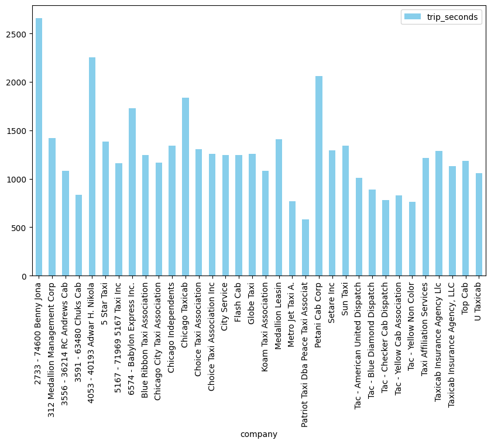
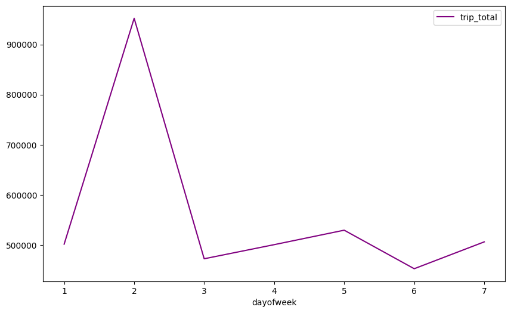
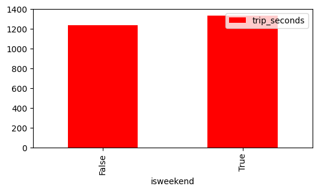
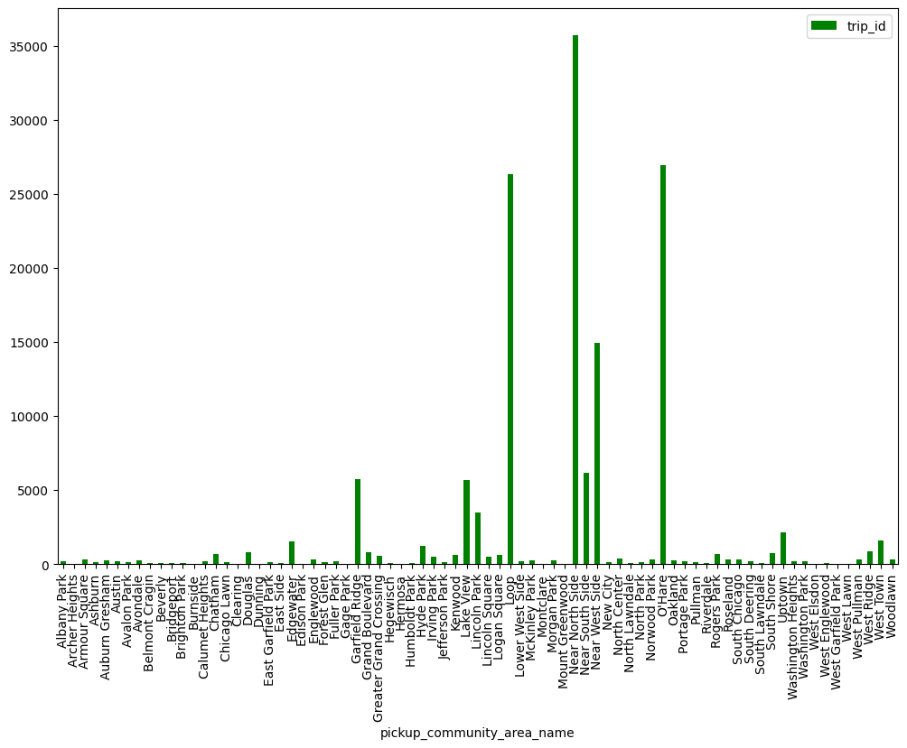

Project Overview
    This project implements an ETL (Extract, Transform, Load) data pipeline using Python and AWS services. The main goal is to extract taxi trips data from Chicago Data Portal and Open-Meteo, transform it with the help of dimension tables, and load it into a Amazon S3 file storage.

Technologies Used
    Python 3.12
    AWS S3 - For storing and accessing data.
    AWS Lambda - For automating the ETL process.
    AWS Glue - For data transformation.
    Boto3 - AWS SDK for Python, for interacting with AWS services.

Architecture
    The ETL process consists of the following steps:
        - Extract: Extract data from Chicago Data Portal and Open-Meteo with API.
        - Transform: Clean and transform the data using Python.
        - Load: Load the transformed data into the target destination (S3).

